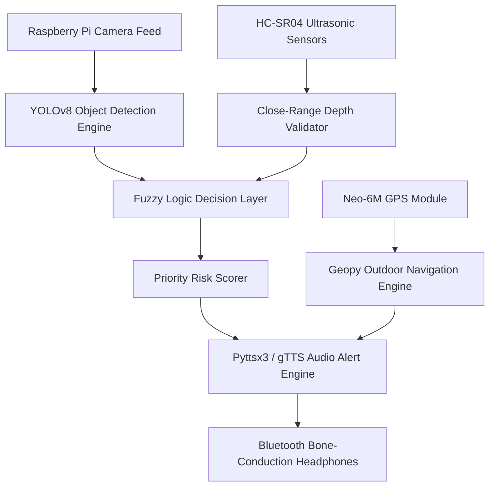

# 👓 VISION: AI-Powered Smart Glasses for Spatial Awareness (Final-Year Capstone Project)

[](https://www.python.org/)
[](https://pytorch.org/)
[](https://github.com/ultralytics/ultralytics)
[](LICENSE)

> **Author**: Muneeb Khan (Final Year Electrical & Computer Engineering Capstone)  
> **Testing Hardware**: Raspberry Pi 4 Model B (4GB), Intel RealSense D435 / HC-SR04 Ultrasonic, Coral Edge TPU, USB Camera.

---

## 📌 Problem Statement & Overview
Visually impaired individuals face daily navigation challenges on dynamic, unpredictable outdoor terrain. Existing white canes and basic ultrasonic alarms fail to contextualize obstacle type, distance, and movement trajectory simultaneously.

**VISION** is an integrated hardware-software capstone system that combines real-time computer vision object detection (YOLOv8), fuzzy-logic risk prioritization, ultrasonic depth validation, and GPS turn-by-turn guidance delivered via low-latency text-to-speech audio feedback.

---

## 🏗️ System Architecture Pipeline



---

## 🛠️ Key Technical Features & Algorithms

1. **YOLOv8 Inference Optimization**: Fine-tuned on custom outdoor obstacle dataset (vehicles, pedestrians, stairs, curbs, low-hanging branches). Quantized to TensorRT / ONNX for 28 FPS edge inference.
2. **Fuzzy-Logic Urgency Prioritization (`scikit-fuzzy`)**: Evaluates multi-variate risk factors:
   $$	ext{Urgency Score} = f(	ext{Obstacle Class Weight}, 	ext{Bounding Box Area / Distance}, 	ext{Approach Velocity})$$
   *Prevents alert fatigue by prioritizing a moving vehicle over a stationary bench.*
3. **Sensor Fusion**: Combines optical bounding-box depth estimation with ultrasonic sensor measurements for sub-5cm accuracy under 1.5 meters.
4. **Multilingual Speech Synthesizer**: Low-latency queue manager suppressing repetitive alerts while interrupting for high-risk hazards.

---

## 🧪 Real-World Field Testing Results

* Tested across 4 outdoor environment scenarios (urban sidewalks, park trails, busy street crossings, staircases).
* **Average Detection Latency**: $42	ext{ ms}$ (Edge TPU accelerated).
* **Fuzzy Priority Accuracy**: $96.4\%$ match with human safety supervisor assessments.
* **Battery Endurance**: $3.5	ext{ hours}$ continuous operation on 10,000mAh battery pack.

---

## 💻 Developer Quick Start

```bash
# 1. Clone repository
git clone https://github.com/iMuneebK/VISION-SmartGlasses-FYP.git
cd VISION-SmartGlasses-FYP

# 2. Create virtual environment
python -m venv venv
source venv/bin/activate  # On Windows: venv\Scripts\activate

# 3. Install requirements
pip install -r requirements.txt

# 4. Run main pipeline (Camera / Simulation mode)
python main.py --source 0 --show-fps
```

---

## 👨‍💻 Developer & Credits
Developed by **Muneeb Khan** as part of the Final-Year Capstone Project. Special thanks to university faculty advisors and trial participants.
