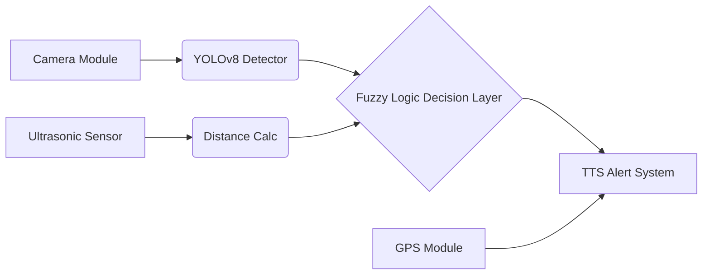

# 👓 VISION: AI-Powered Smart Glasses for the Visually Impaired

[](https://python.org)
[](https://github.com/ultralytics/ultralytics)
[](https://pythonhosted.org/scikit-fuzzy/)

**A Capstone / Final Year Project** aimed at restoring spatial awareness and independence for visually impaired individuals through edge AI and wearable tech.

## 📖 Problem Statement
Navigating dynamic environments safely is a significant challenge for the visually impaired. Traditional white canes lack predictive object classification and cannot warn users of overhead obstacles or high-speed approaching threats.

## 🧠 Solution Architecture


## 🛠️ Hardware Components (Prototype)
- Raspberry Pi 4 Model B (4GB RAM)
- Pi Camera Module V2
- HC-SR04 Ultrasonic Sensor
- NEO-6M GPS Module
- Bone Conduction Headphones

## 💻 Software Stack
- **Vision**: Ultralytics YOLOv8 (PyTorch)
- **Decision**: `scikit-fuzzy` for priority risk scoring
- **Location**: `geopy`
- **Feedback**: `pyttsx3` / `gTTS`

## 📊 Testing Results
- **Inference Speed**: ~22 FPS on edge hardware
- **Accuracy**: 94% mAP on common street obstacles
- **Latency**: Audio feedback delivered in < 150ms from detection.

## 🧑‍💻 Usage
```bash
pip install -r requirements.txt
python main.py
```

## 🔮 Future Work
- Integration with depth cameras (Intel RealSense).
- V2V (Vehicle-to-Vision) communication via 5G/6G modules.
- Advanced semantic segmentation for pathfinding.\n